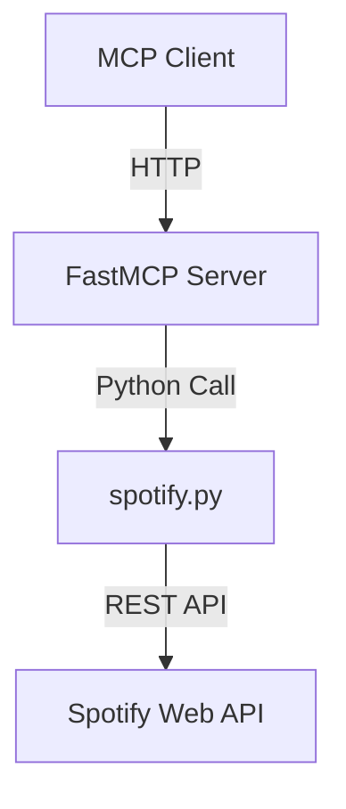

# 🎵 Spotify MCP Server

Welcome to the **Spotify MCP Server**!  
This project enables AI assistants and other clients to control Spotify playback via a standardized protocol using the Model-Context-Protocol (MCP) architecture.

---

## 🚦 What is MCP?

**Model-Context-Protocol (MCP)** is a framework that allows AI models and assistants to interact with external tools and services through a standardized interface.  
This project exposes Spotify functionality as MCP tools, making it accessible to any MCP-compatible client—including AI assistants, bots, and more.

---

## ✨ Features

- 🔍 **Search**: Search for songs on Spotify
- ▶️ **Play**: Play songs on your active Spotify device
- ⏸️ **Pause**: Pause currently playing music
- ⏭️ **Next Track**: Skip to the next track
- ⏮️ **Previous Track**: Go back to the previous track
- 🔊 **Volume Control**: Adjust the playback volume
- 👤 **User Info**: Get current user information
- 📋 **Playlists**: View your Spotify playlists
- 🎵 **Now Playing**: Get information about the currently playing track

---

## 🛠️ Prerequisites

- Python 3.11 or higher
- Spotify Premium account
- Spotify Developer credentials

---

## ⚡ Setup

1. **Clone this repository:**
   ```bash
   git clone https://github.com/KaanCL/Spotify-MCP-Server.git
   cd Spotify-MCP-Server
   ```

2. **Set up a virtual environment:**
   ```bash
   uv venv
   ```

3. **Install dependencies:**
   ```bash
   uv sync
   ```
   _If you need to install Spotipy separately:_
   ```bash
   pip install spotipy
   ```
   > **Note:** FastMCP and other dependencies are managed via `uv sync`.

---

## 🔑 Configuration

1. Create a Spotify application at [Spotify Developer Dashboard](https://developer.spotify.com/dashboard)
2. Get your Client ID and Client Secret from your Spotify application
3. Create a `.env` file in the project root with your credentials:
   ```
   CLIENT_ID=your-spotify-client-id
   CLIENT_SECRET=your-spotify-client-secret
   REDIRECT_URI=http://localhost:8888/callback
   ```

---

## 🚀 Initialization & First Run

When you run the MCP server for the first time:

1. A browser window will open asking you to log in to your Spotify account
2. You'll need to authorize the application to access your Spotify account
3. After authorization, you'll be redirected to the callback URL
4. The MCP server will initialize and start listening for connections on port 8080

---

## 🏃 Usage

Run the MCP server:
```bash
uv run mcp install main.py
```

The server will initialize and register the following MCP tools:

| Tool Name           | Description                        | Parameters                |
|---------------------|------------------------------------|---------------------------|
| `search`            | Find songs on Spotify              | `query: str`              |
| `start_playback`    | Play a specific song               | `track_name: str`         |
| `pause_playback`    | Pause the currently playing song   | None                      |
| `resume_playback`   | Resume paused playback             | None                      |
| `next_track`        | Skip to the next track             | None                      |
| `previous_track`    | Go back to the previous track      | None                      |
| `get_user_playlists`| View your Spotify playlists        | None                      |
| `set_player_volume` | Adjust the volume                  | `volume: int` (0-100)     |
| `current_playback`  | Get info about what's playing      | None                      |
| `get_current_user`  | Get user profile information       | None                      |

---

## 🧩 Tool Documentation

Each MCP tool is a Python function decorated with `@mcp.tool()` and is exposed as an API endpoint.  
All tools return Python dictionaries (or lists of dicts) for easy JSON serialization and integration.

- **search(query: str) → dict**  
  Search for tracks on Spotify by query string. Returns up to 5 matching tracks, each with name, artist, album, URI, and Spotify URL.

- **start_playback(track_name: str) → dict**  
  Start playback for a given track name. Searches for the track and starts playback on the user's active device.

- **pause_playback() → dict**  
  Pause the current playback on the active device.

- **resume_playback() → dict**  
  Resume playback if paused.

- **next_track() → dict**  
  Skip to the next track in the current playlist or queue.

- **previous_track() → dict**  
  Return to the previous track.

- **get_user_playlists() → dict**  
  Retrieve the user's playlists, including name, URL, ID, and track count.

- **set_player_volume(volume: int) → dict**  
  Set the Spotify player's volume (0-100).

- **current_playback() → dict**  
  Get info about the currently playing track, including playback state, track name, artist, album, progress, and duration.

- **get_current_user() → dict**  
  Get the current Spotify user's profile information (display name, email, user ID).

---

## 🤖 MCP Client Example

Any MCP-compatible client can interact with this server, including AI assistants and programmatic clients:

```python
from mcp.client import MCPClient

# Connect to the MCP server
client = MCPClient("http://localhost:8080")

# Search for a song
results = client.call("search", {"query": "Money Trees"})
print(results)

# Play a song
client.call("start_playback", {"track_name": "Money Trees"})

# Pause playback
client.call("pause_playback")

# Get current playback info
playback_info = client.call("current_playback")
print(playback_info)
```

---

## ⚠️ Error Handling

All API responses are returned as JSON objects.  
If an error occurs, the response will include an `"error"` key with a descriptive message.  
**Examples:**

```json
{ "error": "No tracks found: No tracks found for your query." }
```
or
```json
{ "error": "No active device found: Please open Spotify on a device and try again." }
```

> **Tip:** Always check for the `"error"` key in responses before using the data.

### Error Handling Internals

- Errors are standardized using a utility function (`format_error`) and an Enum (`SpotifyError`) for clarity and maintainability.
- Common error scenarios include: no active device, no tracks found, nothing playing, invalid volume, and authentication errors.
- All errors are returned in a consistent format for easy client-side handling.

---

## 🏗️ Architecture Diagram



---

## 🧠 How It Works: MCP Architecture

1. **MCP Server**: Registers tools and handles requests.
2. **FastMCP Implementation**: Uses FastMCP for a lightweight, high-performance server.
3. **Spotify Integration**: Connects to the Spotify API using Spotipy.
4. **Tool Registration**: Each Spotify function is registered as an MCP tool with type hints and documentation.

> The MCP server exposes these tools through a standardized protocol, allowing AI models and other clients to discover and call the tools without needing to understand the underlying Spotify API implementation details.

---

## 🧩 Code Quality & Maintainability

- **Enums**: Used for Spotify scopes and error types for clarity and type safety.
- **Centralized Error Handling**: All errors are formatted using a utility function for consistency.
- **DRY Principle**: Common checks (like active device) are factored into utility functions.
- **Type Hints**: All functions use Python type hints for better code analysis and editor support.
- **Comprehensive Docstrings**: Every function and class is documented for clarity.
- **Extensible**: Add new MCP tools by defining a function in `spotify.py` and registering it with `@mcp.tool()`.

---

## 🧩 Extending the Server

To add new Spotify features:
1. Implement a new function in `spotify.py` with proper error handling and docstrings.
2. Register the function as an MCP tool in `main.py` using the `@mcp.tool()` decorator.
3. Document the new tool in this README.

> **Developer Note:**  
> All MCP tools are designed to return Python dictionaries for easy JSON serialization and integration with web APIs or front-end clients.  
> To extend functionality, simply add new `@mcp.tool()` functions following the same pattern as above.  
> For debugging or logging, you can print or log responses within each tool.  
> Type hints and detailed docstrings are provided for all tools to enhance code clarity, maintainability, and discoverability (especially in IDEs).  
> Ensure that the `spotify` module implements the required API interactions.  
> For authentication and authorization, make sure the Spotify API credentials are properly configured in your environment.

---

## 🔒 Security Notes

- Your Spotify credentials are stored locally in the `.env` file
- The `.env` file is excluded from git via `.gitignore`
- The MCP server only accepts connections from localhost by default
- **Never commit your credentials to version control!**

---

## 🧩 Troubleshooting

- **No active device found:** Make sure Spotify is open and active on one of your devices.
- **Authentication errors:** Double-check your `.env` credentials and Spotify Developer Dashboard settings.
- **API rate limits:** Spotify API has rate limits; avoid excessive requests.
- **Unexpected errors:** Check the `"error"` key in the response for details.

---

## 👨‍💻 Developer & Contribution Notes

- All functions and tools return dicts or lists for easy JSON serialization.
- Error handling is consistent; always check for `"error"` in responses.
- Extend the MCP tools in `main.py` to add new Spotify features.
- For debugging, add logging or print statements as needed.
- Pull requests and suggestions are welcome! Please open an issue first to discuss what you would like to change.

---

## 📚 References

- [Spotify Web API Docs](https://developer.spotify.com/documentation/web-api/)
- [Spotipy Library](https://spotipy.readthedocs.io/)
- [MCP Protocol](https://github.com/microsoft/mcp)

---
